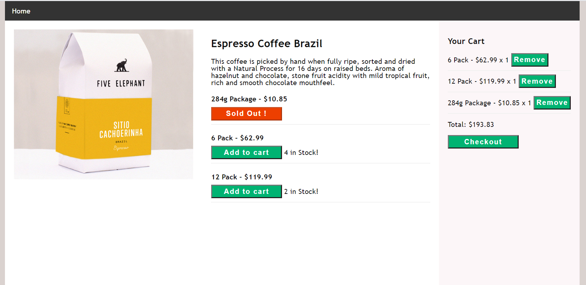

# Shopping cart

This is a Shopping Cart project bootstrapped with [Create React App](https://github.com/facebook/create-react-app) and Redux is used as a state management library.

## Available Scripts

In the project directory, you can run:

#### `cd react-redux-shopping-cart`

#### `yarn start`

Runs the app in the development mode.
Open [http://localhost:3000](http://localhost:3000) to view it in the browser.

## Working

- **Add a product** from the list of variants to cart - reduces the number of inventory.
- Multiple additions of the same product will increase the count of the product in the cart - **displays the number of products and total cost**.
- **Remove a product** from the cart.
- After removing the product the inventory count in the product list is restored.
- Once the inventory is depleted, it cannot be further added to the cart by displaying **"SOLD OUT!"**.
- In the end, **check out the products** that are added to the cart!

## Redux - stores, actions, reducers

- Two sets of global states are stored - **Product list** and cart **Cart items list**.
- Product list - consists of all the products by IDs.
- Cart items - consists of an array of the IDs and an object with key-value pairs of the ID and quantity.
- 6 Actions are created to invoke the reducers and dispatch the data.
- Reducers handle all the calculations and responses with the updated state to action.

## Styling

- Plain CSS is used with grids and media queries for different screen sizes to achieve a responsive web page.

